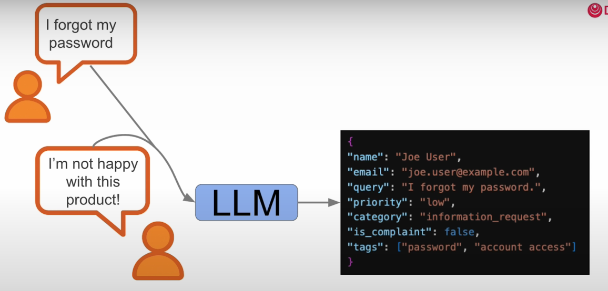

# Multi Agentic Workflows

* Some tasks require more than 1 person!
*

    <figure><figcaption></figcaption></figure>
* Example: Marketing team
*

    <figure><figcaption></figcaption></figure>
* Simple linear audit workflow
*

    <figure><figcaption></figcaption></figure>
* We can also have agents interact in more complex way
* We can ask LLM to call different agents to complete different tasks
*   Here the LLM is like the marketing manager who is coordinating the work with different agents

    <figure><figcaption></figcaption></figure>
