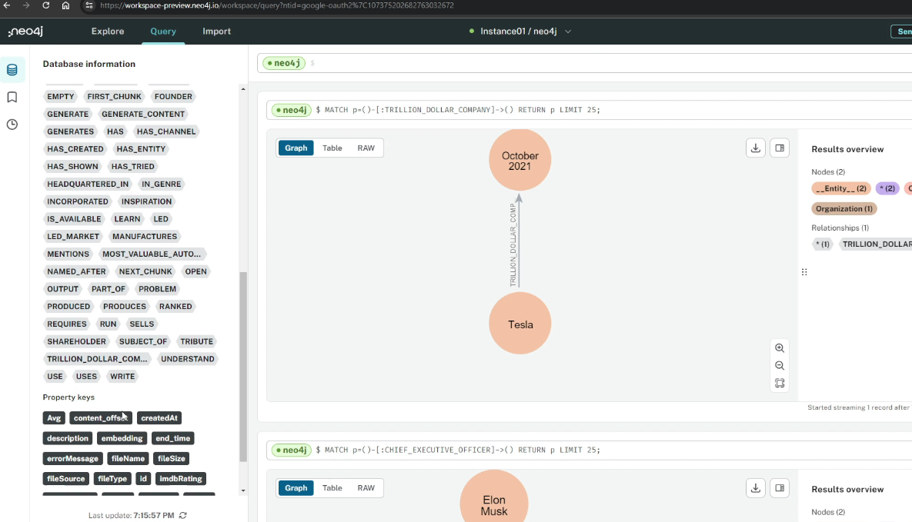

# What is Knowledge Graph

* Semantic network ⇒ Network of real world entities&#x20;
* Example: Events, Situations, Concepts ⇒ Illustrates the relationship between them
* NLP usecase:
  * Rohit sharma is the captain of the indian cricket team
  * Virat kohli is the player of the indian cricket team
  * Here important entities are - Rohit sharam, captain, indian cricket team
* To make the machine help learn much more effeciently we can store it as a knowledge graph
* Knowledge graph:
  * Made of 3 important components
    * Nodes ⇒ Any object or place or person can be a node
    * Edges ⇒ An edges defines the relationship between the nodes
    * Labels ⇒ Specifies what kind of relationship is there
*

    <figure><figcaption></figcaption></figure>
* If we do google search on Virat Kohli, then it will also suggest rohit sharma as there is some relationship them
*

    <figure><figcaption></figcaption></figure>
