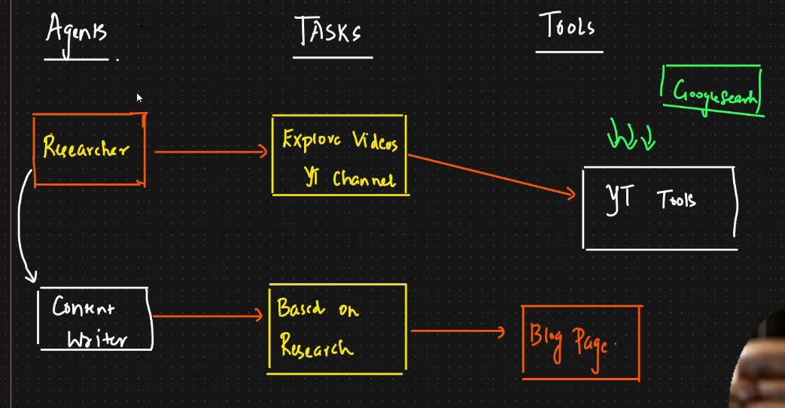

# YouTube Videos to Blog using CrewAI Agents

* CrewAI is agent framework
* In Langchain also we can create agents, but here we will be able to create multiple agents which can interact with each other effeciently
* 3 important contents
  * Agents
    * Here content write, domain expert will be our agents here
  * Tasks
  * Tools
*   This is called sequential process ⇒ Once researcher finishes, it gives its output to Content writer to create blogs

    <figure><figcaption></figcaption></figure>


agents.py

```python
from crewai import Agent
from tools import yt_tool

from dotenv import load_dotenv

load_dotenv()

import os
os.environ["OPENAI_API_KEY"] = os.getenv("OPENAI_API_KEY")
os.environ["OPENAI_MODEL_NAME"]="gpt-4-0125-preview"


## Create a senior blog content researcher

blog_researcher=Agent(
    role='Blog Researcher from Youtube Videos',
    goal='get the relevant video transcription for the topic {topic} from the provided Yt channel',
    verboe=True,
    memory=True,
    backstory=(
       "Expert in understanding videos in AI Data Science , MAchine Learning And GEN AI and providing suggestion" 
    ),
    tools=[yt_tool],
    allow_delegation=True
)

## creating a senior blog writer agent with YT tool

blog_writer=Agent(
    role='Blog Writer',
    goal='Narrate compelling tech stories about the video {topic} from YT video',
    verbose=True,
    memory=True,
    backstory=(
        "With a flair for simplifying complex topics, you craft"
        "engaging narratives that captivate and educate, bringing new"
        "discoveries to light in an accessible manner."
    ),
    tools=[yt_tool],
    allow_delegation=False


)
```

tools.py

```python
from crewai import Task
from tools import yt_tool
from agents import blog_researcher,blog_writer

## Research Task
research_task = Task(
  description=(
    "Identify the video {topic}."
    "Get detailed information about the video from the channel video."
  ),
  expected_output='A comprehensive 3 paragraphs long report based on the {topic} of video content.',
  tools=[yt_tool],
  agent=blog_researcher,
)

# Writing task with language model configuration
write_task = Task(
  description=(
    "get the info from the youtube channel on the topic {topic}."
  ),
  expected_output='Summarize the info from the youtube channel video on the topic{topic} and create the content for the blog',
  tools=[yt_tool],
  agent=blog_writer,
  async_execution=False,
  output_file='new-blog-post.md'  # Example of output customization
)

```

tools.py

```python
from crewai_tools import YoutubeChannelSearchTool

# Initialize the tool with a specific Youtube channel handle to target your search
yt_tool = YoutubeChannelSearchTool(youtube_channel_handle='@krishnaik06')
```

crew.py

```python
from crewai import Crew,Process
from agents import blog_researcher,blog_writer
from tasks import research_task,write_task


# Forming the tech-focused crew with some enhanced configurations
crew = Crew(
  agents=[blog_researcher, blog_writer],
  tasks=[research_task, write_task],
  process=Process.sequential,  # Optional: Sequential task execution is default
  memory=True,
  cache=True,
  max_rpm=100,
  share_crew=True
)

## start the task execution process with enhanced feedback
result=crew.kickoff(inputs={'topic':'AI VS ML VS DL vs Data Science'})
print(result)
```
