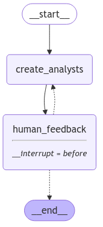

# Personal Assistant - Human Assistant

* &#x20;

```python
from dotenv import load_dotenv
load_dotenv()
import os

from langchain_groq import ChatGroq


#os.environ["OPENAI_API_KEY"]=os.getenv("OPENAI_API_KEY")
os.environ["GROQ_API_KEY"]=os.getenv("GROQ_API_KEY")


llm=ChatGroq(model="qwen-2.5-32b")

from typing import List
from typing_extensions import TypedDict
from pydantic import BaseModel, Field

class Analyst(BaseModel):
    affiliation: str = Field(
        description="Primary affiliation of the analyst.",
    )
    name: str = Field(
        description="Name of the analyst."
    )
    role: str = Field(
        description="Role of the analyst in the context of the topic.",
    )
    description: str = Field(
        description="Description of the analyst focus, concerns, and motives.",
    )
    @property
    def persona(self) -> str:
        return f"Name: {self.name}\nRole: {self.role}\nAffiliation: {self.affiliation}\nDescription: {self.description}\n"

class Perspectives(BaseModel):
    analysts: List[Analyst] = Field(
        description="Comprehensive list of analysts with their roles and affiliations.",
    )

class GenerateAnalystsState(TypedDict):
    topic: str # Research topic
    max_analysts: int # Number of analysts
    human_analyst_feedback: str # Human feedback
    analysts: List[Analyst] # Analyst asking questions

from IPython.display import Image, display
from langgraph.graph import START, END, StateGraph
from langgraph.checkpoint.memory import MemorySaver
from langchain_core.messages import AIMessage, HumanMessage, SystemMessage

analyst_instructions="""You are tasked with creating a set of AI analyst personas. Follow these instructions carefully:

1. First, review the research topic:
{topic}
        
2. Examine any editorial feedback that has been optionally provided to guide creation of the analysts: 
        
{human_analyst_feedback}
    
3. Determine the most interesting themes based upon documents and / or feedback above.
                    
4. Pick the top {max_analysts} themes.

5. Assign one analyst to each theme."""

def create_analysts(state: GenerateAnalystsState):
    
    """ Create analysts """
    
    topic=state['topic']
    max_analysts=state['max_analysts']
    human_analyst_feedback=state.get('human_analyst_feedback', '')
        
    # Enforce structured output
    structured_llm = llm.with_structured_output(Perspectives)

    # System message
    system_message = analyst_instructions.format(topic=topic,
                                                            human_analyst_feedback=human_analyst_feedback, 
                                                            max_analysts=max_analysts)

    # Generate question 
    analysts = structured_llm.invoke([SystemMessage(content=system_message)]+[HumanMessage(content="Generate the set of analysts.")])
    
    # Write the list of analysis to state
    return {"analysts": analysts.analysts}

def human_feedback(state: GenerateAnalystsState):
    """ No-op node that should be interrupted on """
    pass


def should_continue(state: GenerateAnalystsState):
    """ Return the next node to execute """

    # Check if human feedback
    human_analyst_feedback=state.get('human_analyst_feedback', None)
    if human_analyst_feedback:
        return "create_analysts"
    
    # Otherwise end
    return END

# Add nodes and edges 
builder = StateGraph(GenerateAnalystsState)
builder.add_node("create_analysts", create_analysts)
builder.add_node("human_feedback", human_feedback)
builder.add_edge(START, "create_analysts")
builder.add_edge("create_analysts", "human_feedback")
builder.add_conditional_edges("human_feedback", should_continue, ["create_analysts", END])

# Compile
memory = MemorySaver()
graph = builder.compile(interrupt_before=['human_feedback'], checkpointer=memory)

# View
display(Image(graph.get_graph(xray=1).draw_mermaid_png()))

# Input
max_analysts = 3 
topic = "The benefits of adopting LangGraph as an agent framework"
thread = {"configurable": {"thread_id": "1"}}

# Run the graph until the first interruption
for event in graph.stream({"topic":topic,"max_analysts":max_analysts,}, thread, stream_mode="values"):
    analysts=event.get("analysts",'')
    if analysts:
        for analyst in analysts:
            print(f"Name: {analyst.name}")
            print(f"Affiliation: {analyst.affiliation}")
            print(f"Role: {analyst.role}")
            print(f"Description: {analyst.description}")
            print("-" * 50) 
#Name: Dr. Emily Carter
#Affiliation: TechThink Institute
#Role: Tech Innovator
#Description: Dr. Carter is a leading ....
#--------------------------------------------------
#Name: Johnathan Lee
#Affiliation: GlobalTech Solutions
#Role: Business Strategist
#Description: Johnathan Lee....
#--------------------------------------------------
#Name: Samantha Ray
#Affiliation: Digital Ethics Council
#Role: Ethics Advocate
#Description: Samantha Ray is an ....
#--------------------------------------------------

state=graph.get_state(thread)

state.next
#('human_feedback',)

# We now update the state as if we are the human_feedback node
graph.update_state(thread, {"human_analyst_feedback": 
                            "Add in someone from a startup to add an entrepreneur perspective"}, as_node="human_feedback")
#{'configurable': {'thread_id': '1',
#  'checkpoint_ns': '',
#  'checkpoint_id': '1eff1d5b-be3c-6c17-8002-8aad49239f3f'}}

# Continue the graph execution
for event in graph.stream(None, thread, stream_mode="values"):
    # Review
    analysts = event.get('analysts', '')
    if analysts:
        for analyst in analysts:
            print(f"Name: {analyst.name}")
            print(f"Affiliation: {analyst.affiliation}")
            print(f"Role: {analyst.role}")
            print(f"Description: {analyst.description}")
            print("-" * 50) 
#Name: Dr. Emily Carter
#Affiliation: TechThink Institute
#Role: Tech Innovator
#Description: Dr. Carter is a leading technologist who focuses on the evolution of AI and its integration with innovative frameworks like LangGraph. She is keen on exploring how new technologies can drive efficiency and innovation in AI systems.
#--------------------------------------------------
#Name: Johnathan Lee
#Affiliation: GlobalTech Solutions
#Role: Business Strategist
#Description: Johnathan Lee is a business strategist who evaluates the potential of new technologies to impact business operations and strategies. His primary interest is in how LangGraph can streamline and improve business processes.
#--------------------------------------------------
#Name: Samantha Ray
#Affiliation: Digital Ethics Council
#Role: Ethics Advocate
#Description: Samantha Ray is an advocate for ethical AI practices. She examines the ethical implications and compliance aspects of adopting new AI frameworks like LangGraph in the industry.
#--------------------------------------------------
#Name: Dr. Jane Lee
#Affiliation: University of Technology Sydney
#Role: Lead Researcher
#Description: An expert in cognitive computing, Dr. Lee is interested in the impact of advanced AI frameworks like LangGraph on cognitive computing and its educational and research implications.
#--------------------------------------------------
#Name: Samuel Thompson
#Affiliation: InnovateTech Solutions
#Role: CTO
#Description: As a tech startup leader, Samuel is keen on exploring how adopting LangGraph can provide a competitive edge and aid in scaling his company's AI capabilities.
#--------------------------------------------------
#Name: Robert Kim
#Affiliation: Global Financial Group
#Role: Senior Data Analyst
#Description: Robert focuses on the financial sector and is interested in the cost-benefit analysis and potential ROI of integrating LangGraph into existing data analytics frameworks.
#--------------------------------------------------

further_feedack = None
graph.update_state(thread, {"human_analyst_feedback": 
                            further_feedack}, as_node="human_feedback")
#{'configurable': {'thread_id': '1',
#  'checkpoint_ns': '',
#  'checkpoint_id': '1eff1d5d-fb79-642f-8004-993c0f10e783'}}

# Continue the graph execution to end
for event in graph.stream(None, thread, stream_mode="updates"):
    print("--Node--")
    node_name = next(iter(event.keys()))
    print(node_name)

final_state = graph.get_state(thread)
analysts = final_state.values.get('analysts')

final_state.next
#()
```

*

    <figure><figcaption></figcaption></figure>
