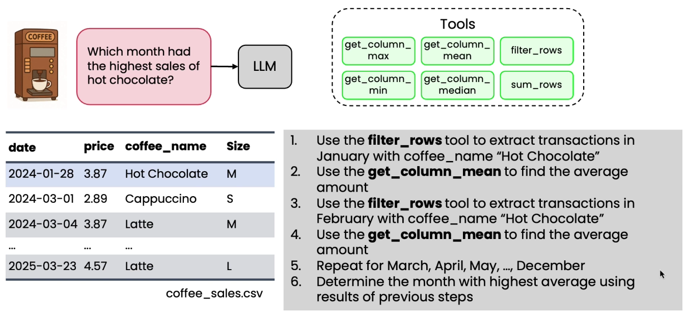
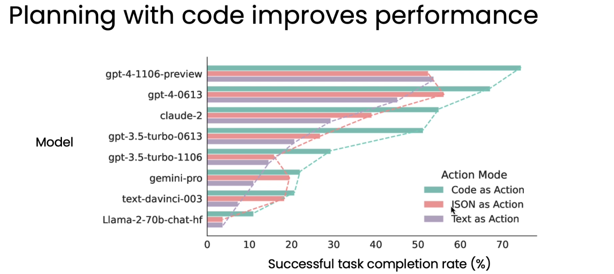

# Planning with Code Execution

* Instead of asking LLM to output plain json and execute one step at a time, we will have the LLM write the code and then code can capture multiple steps of the plan like call the function, then call this function
* And then by executing code generated by the LLM, we can actually carry out fairly complex plans
* Challenge of planning with tools:
*

    <figure><figcaption></figcaption></figure>
* If we ask 'How many transactions last week' then we wont be able to answer using the existing tools
* If we keep on adding tools like this, then it is brittle and inefficient and continuously dealing with edge cases
* We can ask the LLM to write the code to solve the users query
* Planning with code improves performance
*

    <figure><figcaption></figcaption></figure>

