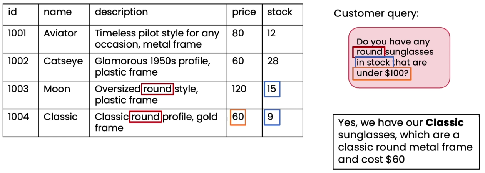
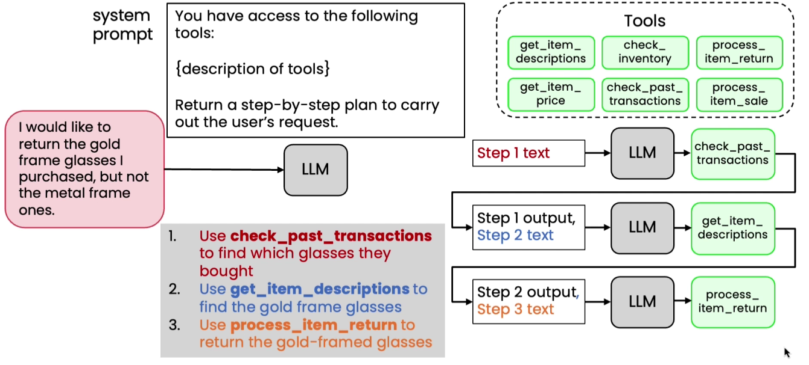
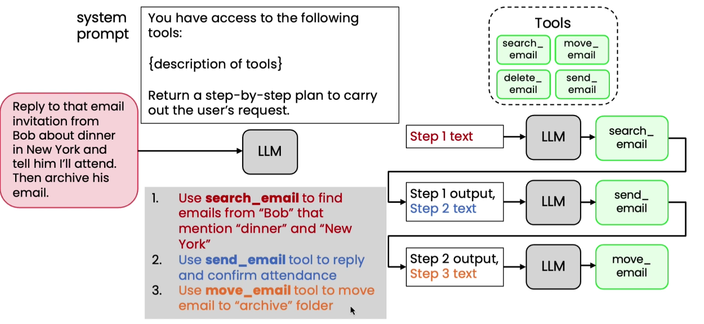

# Planning Workflows

* This is a complex query
*

    <figure><figcaption></figcaption></figure>
* Different tools will be given to the users
*   &#x20;

    <figure><figcaption></figcaption></figure>
* We did not have to decide the sequence in which to call the tools
*

    <figure><figcaption></figcaption></figure>
*

    <figure><figcaption></figcaption></figure>
