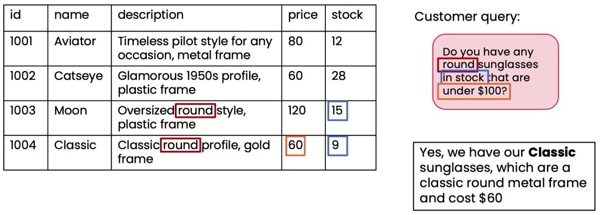
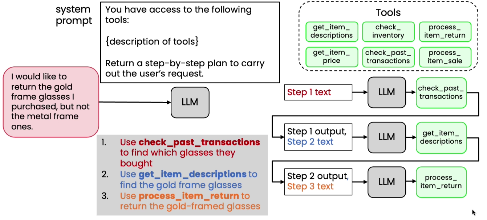
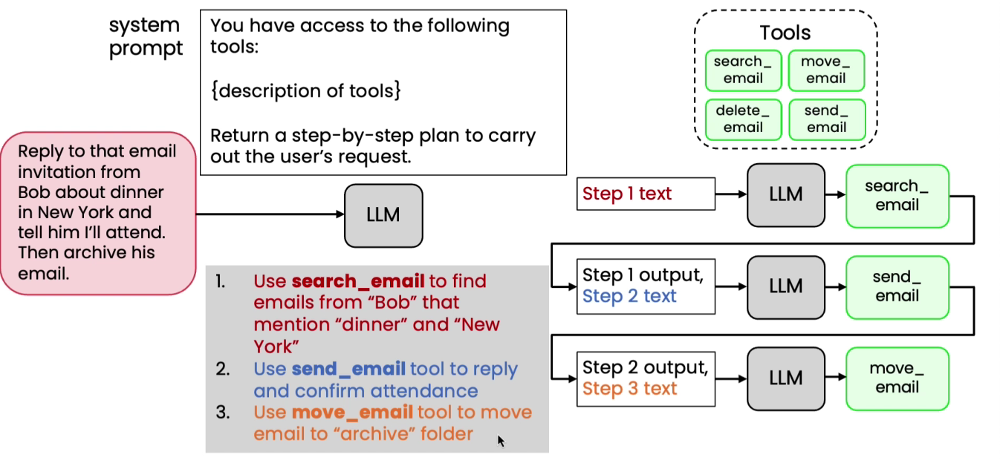

# 🟢 Planning Workflows

* <mark style="color:purple;background-color:purple;">**Different tools will be given**</mark>
* <mark style="color:purple;background-color:purple;">**For a complex query**</mark>
*   <mark style="color:purple;background-color:purple;">**We did not have to decide the sequence in which to call the tools**</mark>

    <figure><figcaption></figcaption></figure>
*
*   &#x20;

    <figure><figcaption></figcaption></figure>
*
*

    <figure><figcaption></figcaption></figure>
*

    <figure><figcaption></figcaption></figure>
