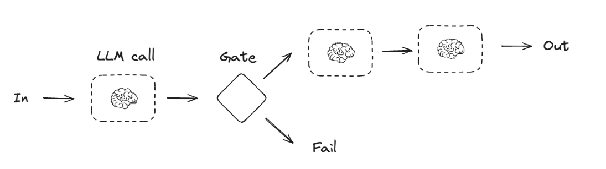
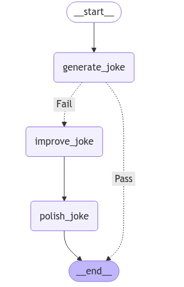

# Prompt Chaining

* Prompt chaining decomposes a task into a sequence of steps, where each LLM call processes the output of the previous one.&#x20;
* You can add programmatic checks on any intermediate steps to ensure that the process is still on track.
* When to use this workflow: This workflow is ideal for situations where the task can be easily and cleanly decomposed into fixed subtasks.&#x20;
* The main goal is to trade off latency for higher accuracy, by making each LLM call an easier task.
*

    <figure><figcaption></figcaption></figure>

```python
import os
from dotenv import load_dotenv
load_dotenv()

from langchain_groq import ChatGroq


#os.environ["OPENAI_API_KEY"]=os.getenv("OPENAI_API_KEY")
os.environ["GROQ_API_KEY"]=os.getenv("GROQ_API_KEY")


llm=ChatGroq(model="qwen-2.5-32b")

from typing_extensions import TypedDict
from langgraph.graph import StateGraph, START, END
from IPython.display import Image, display


# Graph state
class State(TypedDict):
    topic: str
    joke: str
    improved_joke: str
    final_joke: str

# Nodes
def generate_joke(state: State):
    """First LLM call to generate initial joke"""

    msg = llm.invoke(f"Write a short joke about {state['topic']}")
    return {"joke": msg.content}

def check_punchline(state: State):
    """Gate function to check if the joke has a punchline"""

    # Simple check - does the joke contain "?" or "!"
    if "?" in state["joke"] or "!" in state["joke"]:
        return "Fail"
    return "Pass"

def improve_joke(state: State):
    """Second LLM call to improve the joke"""

    msg = llm.invoke(f"Make this joke funnier by adding wordplay: {state['joke']}")
    return {"improved_joke": msg.content}

def polish_joke(state: State):
    """Third LLM call for final polish"""

    msg = llm.invoke(f"Add a surprising twist to this joke: {state['improved_joke']}")
    return {"final_joke": msg.content}


# Build workflow
workflow = StateGraph(State)

# Add nodes
workflow.add_node("generate_joke", generate_joke)
workflow.add_node("improve_joke", improve_joke)
workflow.add_node("polish_joke", polish_joke)

# Add edges to connect nodes
workflow.add_edge(START, "generate_joke")
workflow.add_conditional_edges("generate_joke",check_punchline,{"Fail":"improve_joke","Pass":END})
workflow.add_edge("improve_joke", "polish_joke")
workflow.add_edge("polish_joke", END)

# Compile
chain = workflow.compile()

# Show workflow
display(Image(chain.get_graph().draw_mermaid_png()))

# Invoke
state = chain.invoke({"topic": "cats"})
#{'topic': 'cats',
# 'joke': "Why don't cats play poker in the wild? Because there are too many cheetahs!",
# 'improved_joke': 'Why don\'t cats play poker in the wild? Because there are too many cheetahs, and every game ends with a "spots" decision!',
# 'final_joke': 'Why don\'t cats play poker in the wild? Because there are too many cheetahs, and every game ends with a "spots" decision! But it gets even more surprising when you find out that the real reason is one clever cheetah who learned to bluff so well, it convinced everyone it was a royal flush of spots every time, and now it’s the only one at the poker table who knows when the others are really holding great hands or not!'}


```

*

    <figure><figcaption></figcaption></figure>
