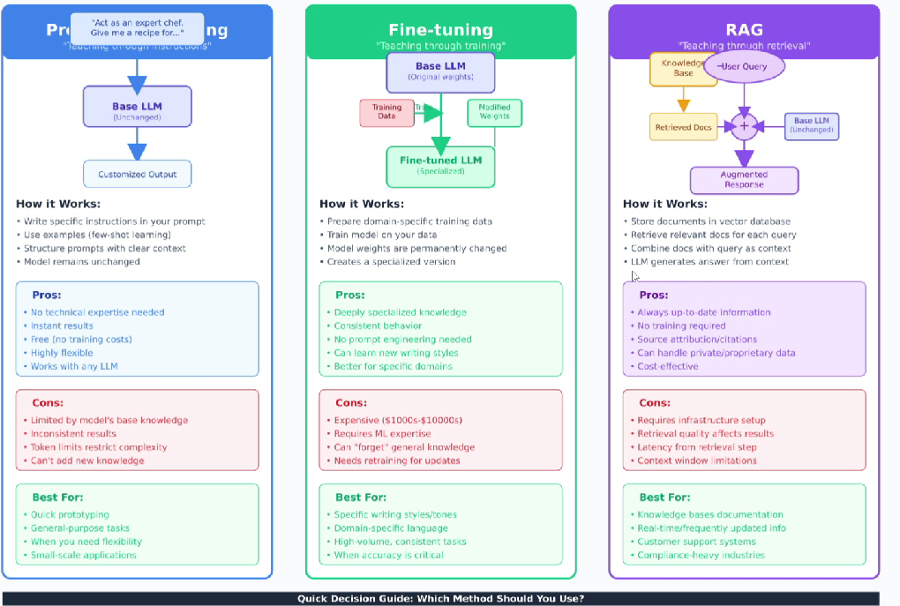
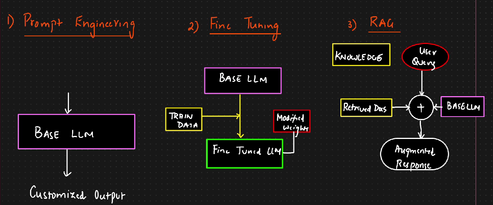

# Prompt Engineering vs Fine Tuning vs RAG

<figure><figcaption></figcaption></figure>

**Prompt Engineering:**

* Prompt should be specific instruction, structured with clear context
* Pros:
  * No technical expertise needed
  * Instant results
  * No training required
  * Works with any LLM
* Cons:
  * Limited by models base knowledge
  * Inconsistent results
  * Every model has token limit restriction
  * Cant add new knowledge
* Best for:
  * Small scale application
  * Generic purpose tasks
  * Quick prototyping

**Fine Tuning:**

* For company specific use case
* We will get the company specific training data
* Weights will be modified
* Train model on company's data
* Pros:
  * Deeply specialized knowledge
  * Consistent behavior
  * No prompt engineering needed
  * Better for specific domain
* Cons:
  * Expensive as GPU will be needed
  * Require ML expertise
  * Regular retraining is required for updates

Best for:

* Specific style
* High volumes of data
* When accuracy is critical

**RAG:**

* Store documents in vectorDB
* Retrieve relevant docs for each query
* LLM generate answer from context
* **Pros:**
  * Always up to date info
  * No training required
  * Cost effective
  * Accuracy is high&#x20;
  * Can also handle private / propriotory data
* **Cons:**
  * Infrastructure setup needed
  * Retrieval quality affects answers
  * Context window limitation
*

*

    <figure><figcaption></figcaption></figure>
