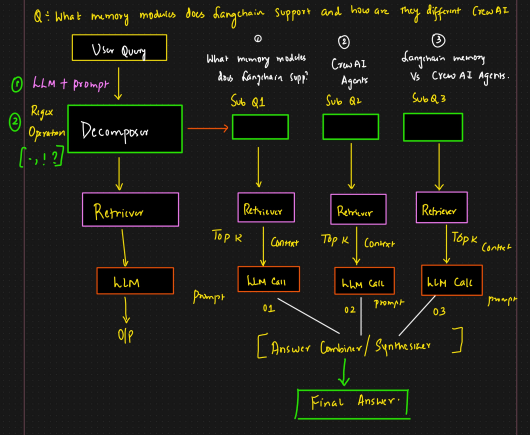

# 🟢 Query Decomposition

* <mark style="color:purple;background-color:purple;">**Taking a complex multi-part questions and breaking it into simpler, atomic sub-questions that can each be retrieved and answered individually**</mark>
* <mark style="color:purple;background-color:purple;">**Sub queries will be formed using LLM + Prompt**</mark>
* <mark style="color:purple;background-color:purple;">**Responses of all the queries will be combined using synthesizer and final answer will be formed**</mark>
* <mark style="color:purple;background-color:purple;">**But this involves lots of LLM calls**</mark>

Why to use?

* Complex queries often involve multiple concepts
* LLMs or retrievers may miss parts of the original questions
* It enables multi-hop reasoning
* Allows parallelism

*

    <figure><figcaption></figcaption></figure>
