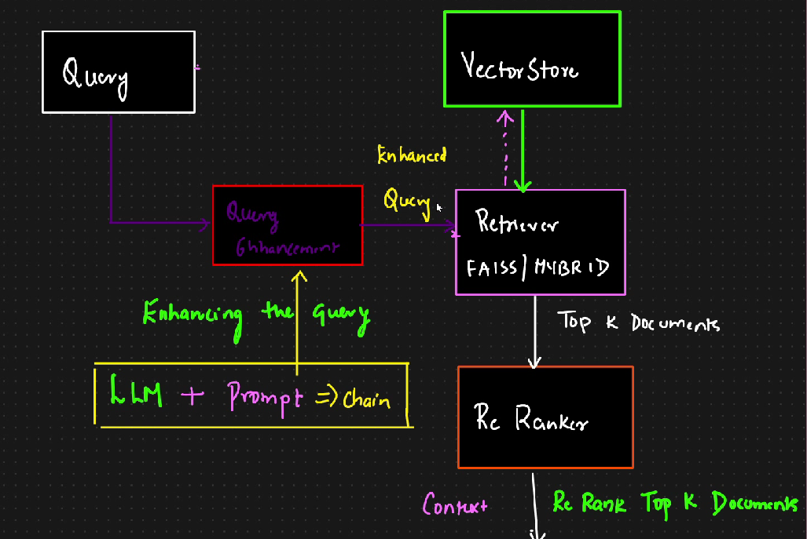

# 🟢 Query Expansion Technique

* <mark style="color:purple;background-color:purple;">**To improve or reformulate the query to retrieve better, more relevant documents from the knowledge base**</mark>
* Useful when:
  * The original query is short, ambiguous or under-specified
  * You want to broaden the scope to catch synonyms, related phrases or spelling variants
* We add a step for query enhancement, this is done by using LLM + prompt
*   Here we will be getting enhanced query

    <figure><figcaption></figcaption></figure>
