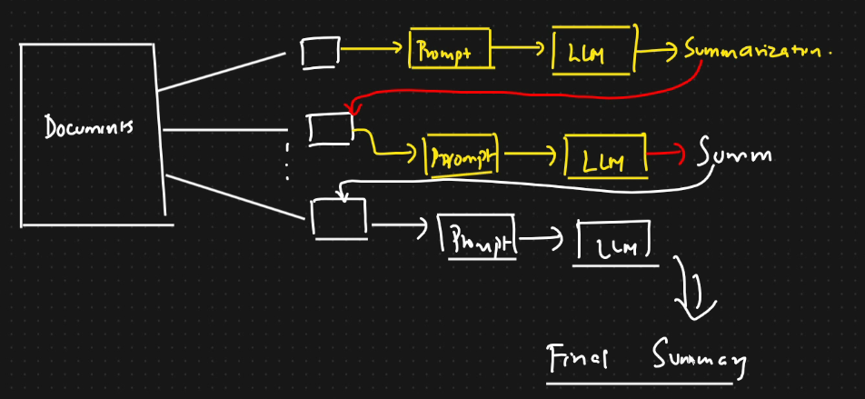

# Refine Chain

* We have documents ⇒ This will be divided into chunks
* We will take the 1st chain and give it to a prompt template and LLM and get summarization
* For the second chain, before sending it to prompt, we will take reference of summarization 1 will get it
* Update a rolling summary be iterating over the documents in a sequence
*

    <figure><figcaption></figcaption></figure>

```python
chain=load_summarize_chain(
    llm=llm,
    chain_type="refine",
    verbose=True
)
output_summary=chain.run(final_documents)
output_summary
```
