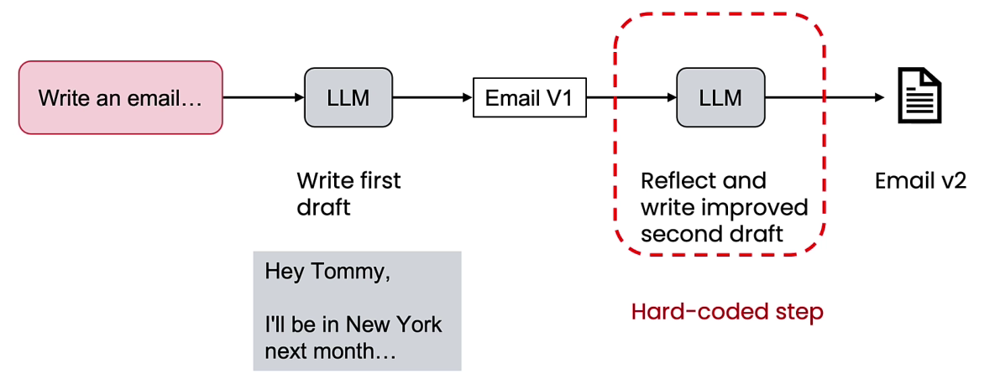
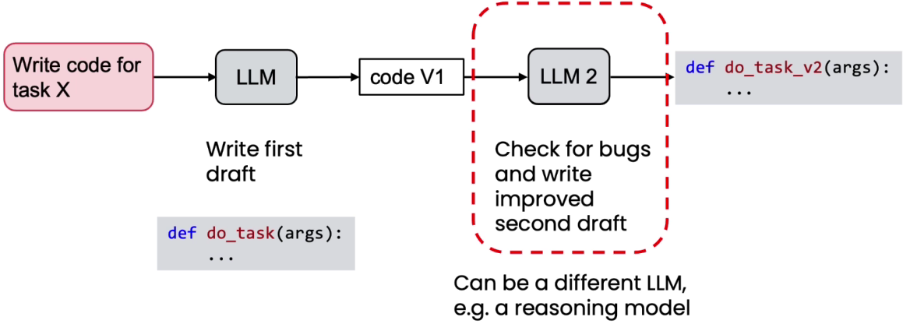
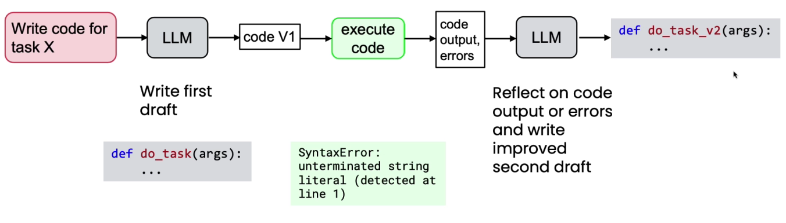

# Reflections to improve output

* Reflect output to improve the output
* We can use the same LLM with different prompt to reflect the work
*

    <figure><figcaption></figcaption></figure>
* We can also use different models for reflection
* We can use a reasoning model
*

    <figure><figcaption></figcaption></figure>
* If we can get external feedback from outside the LLM, then reflection becomes much more powerful
*

    <figure><figcaption></figcaption></figure>
