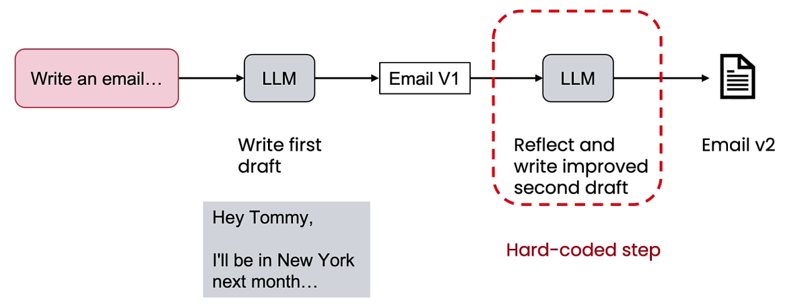
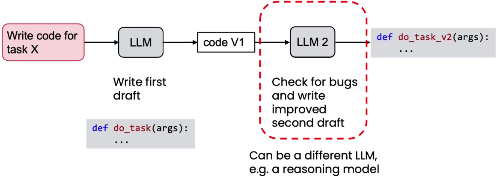
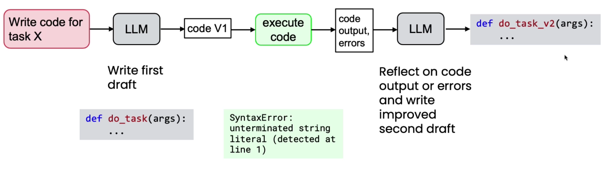

# 🟢 Reflections to improve output

* <mark style="color:purple;background-color:purple;">**Reflect output to improve the output**</mark>
* <mark style="color:purple;background-color:purple;">**We can use the same LLM with different prompt to reflect the work**</mark>
*

    <figure><figcaption></figcaption></figure>
* <mark style="color:purple;background-color:purple;">**We can also use different models for reflection**</mark>
* We can use a reasoning model
*

    <figure><figcaption></figcaption></figure>
* If we can get external feedback from outside the LLM, then reflection becomes much more powerful
*

    <figure><figcaption></figcaption></figure>
