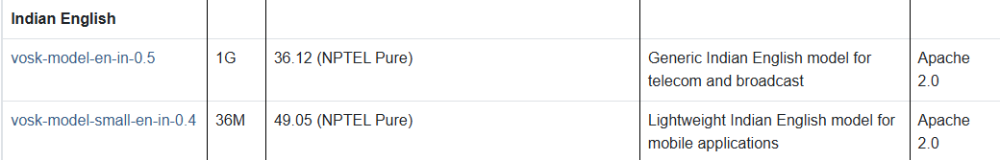

# 🟢 VOSK - Model

* [https://alphacephei.com/vosk/models?utm\_source=chatgpt.com](https://alphacephei.com/vosk/models?utm_source=chatgpt.com)
*

    <figure><figcaption></figcaption></figure>
* <mark style="color:purple;background-color:purple;">**Small model typically is around 50Mb in size and requires about 300Mb of memory in runtime. Big models are for the high-accuracy transcription on the server.**</mark>&#x20;
* <mark style="color:purple;background-color:purple;">**Big models require up to 1Gb in memory since they apply advanced AI algorithms. Ideally you run them on some high-end servers like i7 or latest AMD Ryzen**</mark>
