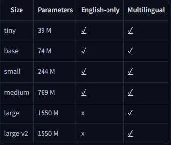

# 🟢 Whisper - Model

* Upgraded to whisper model in <mark style="color:purple;background-color:purple;">**2023**</mark>
* Open-sourced by OpenAI
* <mark style="color:purple;background-color:purple;">**Models released:**</mark><mark style="color:purple;background-color:purple;">**&#x20;**</mark><mark style="color:purple;background-color:purple;">**`tiny, base, small, medium, large`**</mark>
* Trained on 680,000+ hours of multilingual data
* Included strong performance on Indian English + accented speech
*

    <figure><figcaption></figcaption></figure>

**Architecture:**

* <mark style="color:purple;background-color:purple;">**Transformer-based encoder–decoder model**</mark>

**Input to Transformer:**

* Raw audio (waveform) is converted into a log-Mel spectrogram
* <mark style="color:purple;background-color:purple;">**Spectrogram is split into small time windows**</mark>
* <mark style="color:purple;background-color:purple;">**Each window becomes a feature vector**</mark>
* <mark style="color:purple;background-color:purple;">**These vectors are like “tokens” for the Transformer**</mark>

