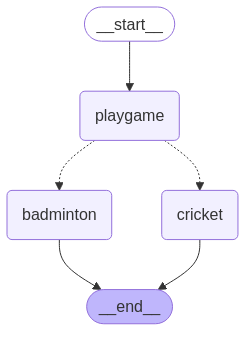

# State Schema with DataClasses

* When we define a LangGraph StateGraph, we use a state schema.
* The state schema represents the structure and types of data that our graph will use.
* All nodes are expected to communicate with that schema.
* LangGraph offers flexibility in how you define your state schema, accommodating various Python types and validation approaches!
* we can use the TypedDict class from python's typing module.
* It allows you to specify keys and their corresponding value types.
* But, note that these are type hints.
* They can be used by static type checkers (like mypy) or IDEs to catch potential type-related errors before the code is run.
* But they are not enforced at runtime!

**Steps:**

*

```python
from dataclasses import dataclass

@dataclass
class DataClassState:
    name:str
    game:Literal["badminton","cricket"]

def play_game(state:DataClassState):
    print("---Play Game node has been called--")
    return {"name":state.name + " want to play "}

def cricket(state:DataClassState):
    print("-- Cricket node has been called--")
    return {"name":state.name + " cricket","game":"cricket"}

def badminton(state:DataClassState):
    print("-- badminton node has been called--")
    return {"name":state.name + " badminton","game":"badminton"}

import random
def decide_play(state:DataClassState)->Literal["cricket","badminton"]:
    # Here, let's just do a 50 / 50 split between nodes 2, 3
    if random.random() < 0.5:
        return "cricket"
    else:
        return "badminton"


builder=StateGraph(DataClassState)
builder.add_node("playgame",play_game)
builder.add_node("cricket",cricket)
builder.add_node("badminton",badminton)

## Flow of the graph

builder.add_edge(START,"playgame")
builder.add_conditional_edges("playgame",decide_play)
builder.add_edge("cricket",END)
builder.add_edge("badminton",END)

# Add
graph = builder.compile()

# View
display(Image(graph.get_graph().draw_mermaid_png()))

graph.invoke(DataClassState(name="KRish",game="cricket"))
#---Play Game node has been called--
#-- Cricket node has been called--
#{'name': 'KRish want to play  cricket', 'game': 'cricket'}


```

<figure><figcaption></figcaption></figure>
