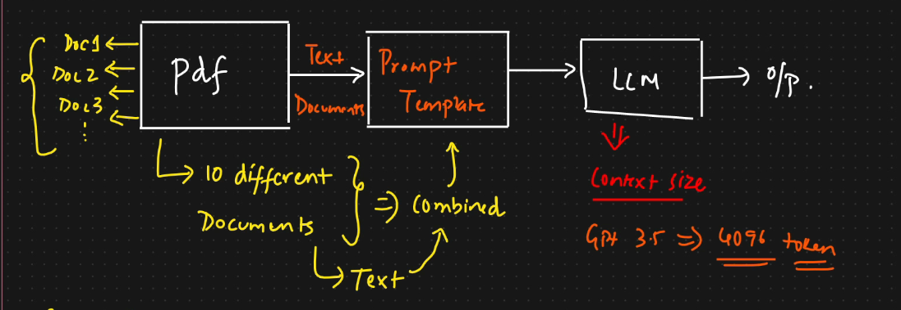
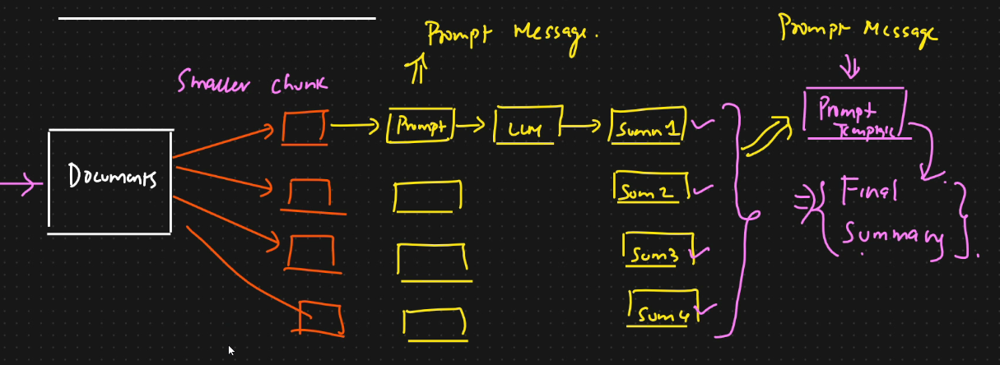

# 🟢 Text Summarization Intution

<mark style="color:purple;background-color:purple;">**Stuff Document Chain:**</mark>

*

```
<figure><figcaption></figcaption></figure>
```

* Most basic type of summarization
* <mark style="color:purple;background-color:purple;">**If there are multiple pdf, then it will be combined and then sent to prompt template**</mark>
*   Challenges:

    * <mark style="color:purple;background-color:purple;">**If pdf is smaller size then it is fine**</mark>
    * <mark style="color:purple;background-color:purple;">**If there are suppose more than 1000 documents - then it becomes very big and cannot be sent to llm model as there is limitation of context size**</mark>
    * <mark style="color:purple;background-color:purple;">**So we use mapreduce**</mark>


<mark style="color:purple;background-color:purple;">**Mapreduce:**</mark>

*

```
<figure><figcaption></figcaption></figure>
```

*

```
<figure><figcaption></figcaption></figure>
```

* <mark style="color:purple;background-color:purple;">**Instead of combining, it will be divided into chunks**</mark>
* <mark style="color:purple;background-color:purple;">**This smaller chunk are passed to a prompt template and LLM and we get summary**</mark>
* <mark style="color:purple;background-color:purple;">**Similarly we get summary for all the chunks**</mark>
* <mark style="color:purple;background-color:purple;">**All this summary are combined to form final summary**</mark>
* <mark style="color:purple;background-color:purple;">**We can also take this final summary and then pass it to another prompt to get refined summary ⇒ Refine Chain:**</mark>
*
