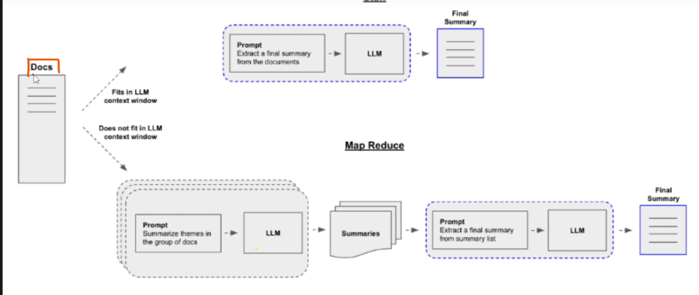

# Text Summarization Intution

Stuff Document Chain:

*

    <figure><figcaption></figcaption></figure>
* Most basic type of summarization
* If there are multiple pdf, then it will be combined and then sent to prompt template
* Challenges:
  * If pdf is smaller size then it is fine
  * If there are suppose more than 1000 documents - then it becomes very big and cannot be sent to llm model as there is limitation of context size
  * So we use mapreduce

Mapreduce:

*

    <figure><figcaption></figcaption></figure>
*

    <figure><figcaption></figcaption></figure>
* Instead of combining, it will be divided into chunks
* This smaller chunk are passed to a prompt template and LLM and we get summar1
* Similarly we get summary for all the chunks
* All this summary are combined to form final summary
* We can also take this final summary and then pass it to another prompt to get refined summary ⇒&#x20;

**Refine Chain:**

*
