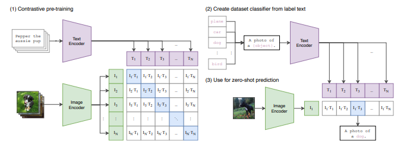

# CLIP

* [https://arxiv.org/pdf/2103.00020](https://arxiv.org/pdf/2103.00020)
* <mark style="color:purple;background-color:purple;">**Image to text**</mark>
* <mark style="color:purple;background-color:purple;">**Multimodality**</mark>
* Previously for image captioning we used to have CNN + LSTM / CNN + BERT ⇒ but they were not much effective
* CLIP is based on transformerg
* Based on encoder
* <mark style="color:purple;background-color:purple;">**Dual encoder will be trained**</mark>
  * <mark style="color:purple;background-color:purple;">**1st Encoder for images**</mark>
  * <mark style="color:purple;background-color:purple;">**2nd Encoder for text**</mark>
* <mark style="color:purple;background-color:purple;">**Image is collection of pixels**</mark>
* <mark style="color:purple;background-color:purple;">**Flatten image(1D Array) is passed to transformer encoder**</mark>
* <mark style="color:purple;background-color:purple;">**Transformer encoder will form contextual embedding**</mark>
* <mark style="color:purple;background-color:purple;">**Text is converted into embedding and passed to transformer encoder which will also give contextual embedding**</mark>
* In training, we will be having image and its caption, we will be passing it to dual encoder
* We will find the cosine similarity of this 2 contextual embeddings
*

    <figure><figcaption></figcaption></figure>
*

    <figure><figcaption></figcaption></figure>
* Zero shot capabilities
