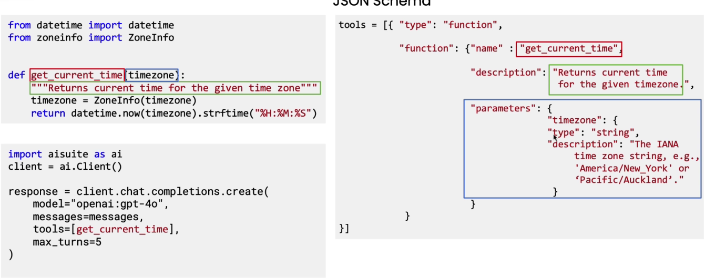

# Tool Call

* &#x20;The function get\_current\_time is automatically described to the LLM to enable it to decide when to use it
*   &#x20;

    <figure><figcaption></figcaption></figure>
* JSON schema is passed to the LLM
*

    <figure><figcaption></figcaption></figure>
