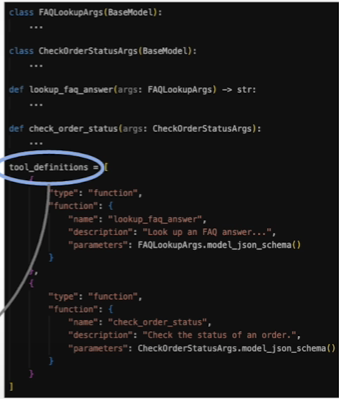
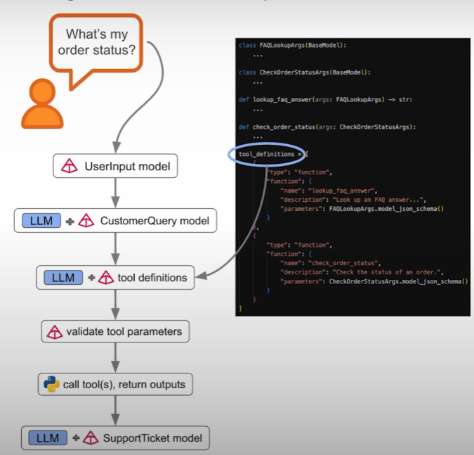

# Tool Calling

* &#x20;We will be taking user input and validate against UserInput model
* We will pass this to LLM and ask it to return valid instance of CustomerQuery Model
* This will be passed to another LLM with tool definitions
  *

      <figure><figcaption></figcaption></figure>
* Job of the LLM is to return parameters for a tool if it is to be called
* We will take the response and first use the pydantic data model for tools and validate the parameters are in order to call the functions
* Call the tools and get output
* This will be passed to another LLM

<figure><figcaption></figcaption></figure>
