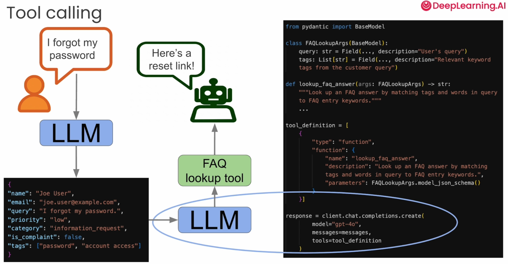

# Tool Calling

* We pass our query and make it generate a structured output
* That output is passed to LLM
* It might call FAQ Lookup tool
* This tool might inform the user password reset link or something
*

    <figure><figcaption></figcaption></figure>
