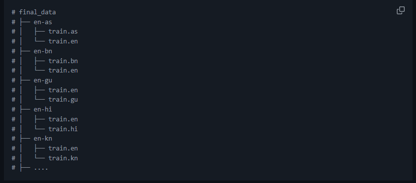

# 🟢 IndicTrans Finetuning

* <mark style="color:purple;background-color:purple;">**Organize the traning data as en-X folders where each folder has two text files containing parallel data for en-X lang pair**</mark>
* <mark style="color:purple;background-color:purple;">**Using fairseq we will finetune it**</mark>&#x20;
* Using nvidia t7 it would take about half day to train
* **Good practical fine-tune:** **\~10k–50k** parallel pairs — _reliable domain adaptation, measurable BLEU/chrF gains, handles terminology and style._
*   <mark style="color:purple;background-color:purple;">**Since we did not have enough data, as well as computing power we did not went ahead with it**</mark>

    <figure><figcaption></figcaption></figure>
