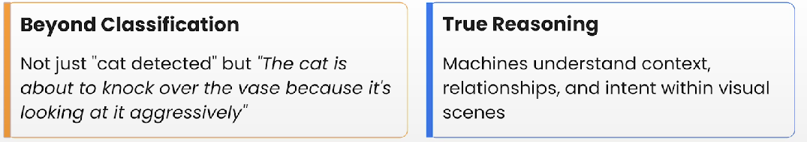
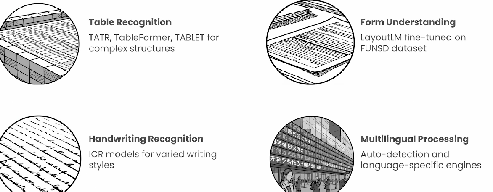

# Vision LLM

* For each use case different model is required
* &#x20;Using VLLM this can be solved&#x20;
*

    <figure><figcaption></figcaption></figure>
*

    <figure><figcaption></figcaption></figure>
