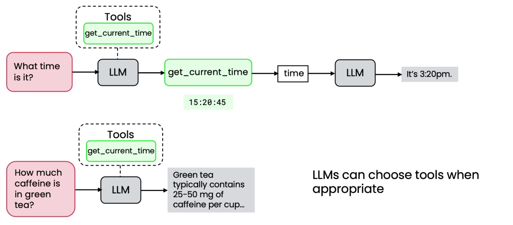
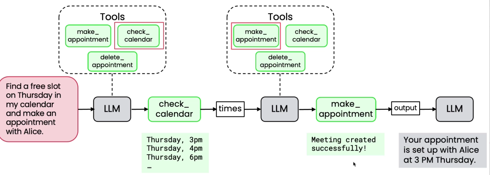

# What are Tools?

* Tools are just functions that we provide to the LLM that it can request to call

**Simple tool execution:**

* LLM looks at the tools available and decide which one to call
* LLM can decide whether or not to use any of the tool
*

    <figure><figcaption></figcaption></figure>

**Multiple Tools:**

*

    <figure><figcaption></figcaption></figure>
