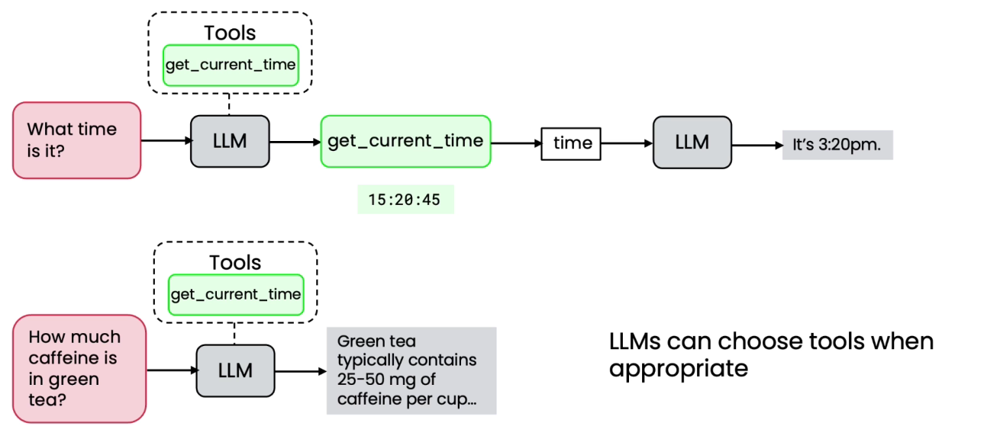
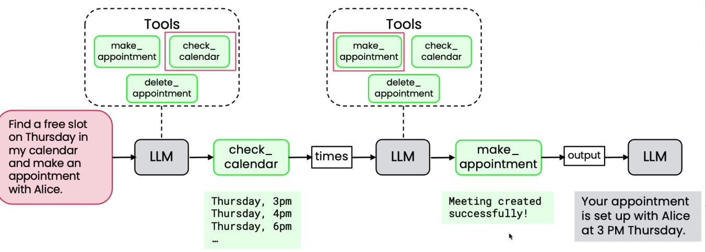

# 🟢 What are Tools?

* <mark style="color:purple;background-color:purple;">**Tools are just functions that we provide to the LLM that it can request to call**</mark>

<mark style="color:purple;background-color:purple;">**Simple tool execution:**</mark>

* <mark style="color:purple;background-color:purple;">**LLM looks at the tools available and decide which one to call**</mark>
* <mark style="color:purple;background-color:purple;">**LLM can decide whether or not to use any of the tool**</mark>
*

    <figure><figcaption></figcaption></figure>

**Multiple Tools:**

*

    <figure><figcaption></figcaption></figure>
