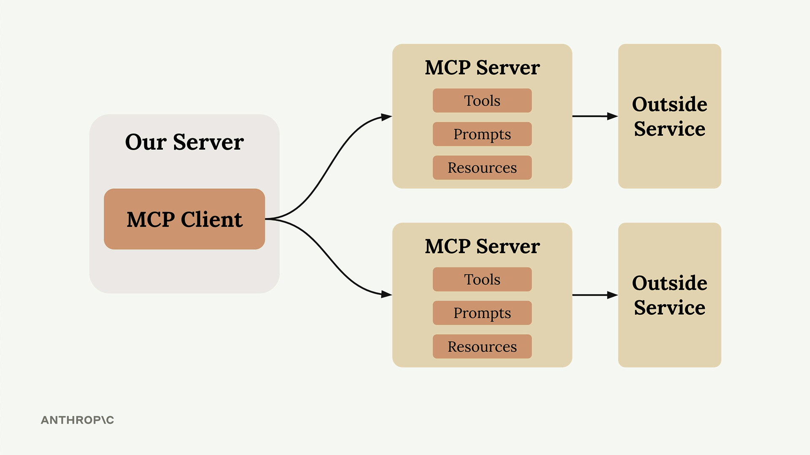

# What is MCP

* Communication layer that provides Claude with context and tools without requiring you to write a bunch of tedious integration code.
* Shift the burden of tool definitions and execution away from your server to specialized MCP servers
*   MCP Client (your server) connecting to MCP Servers that contain tools, prompts, and resources. Each MCP Server acts as an interface to some outside service

    <figure><figcaption></figcaption></figure>
