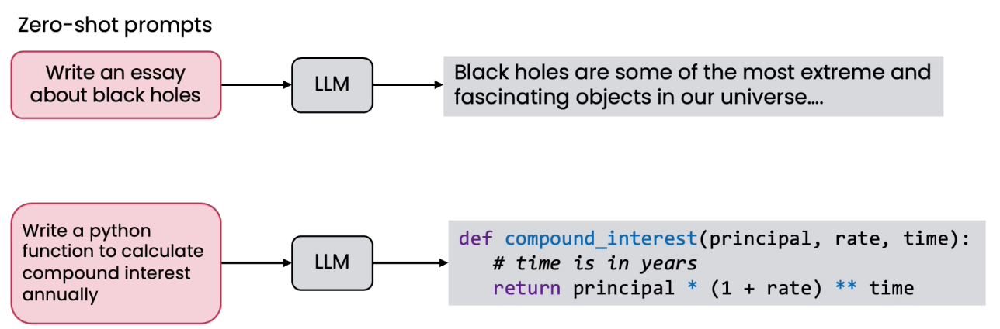
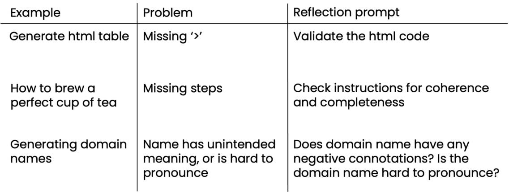
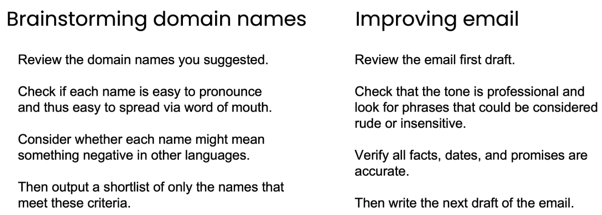

# Why not just Direct Generation

* Direct Generation:
  *

      <figure><figcaption></figcaption></figure>
* It works on a variety of task like sentiment reversal, dialogue response, code optimization, code readability, math reasoning, acronym generation, constrained generation
*

    <figure><figcaption></figcaption></figure>
*

    <figure><figcaption></figcaption></figure>
